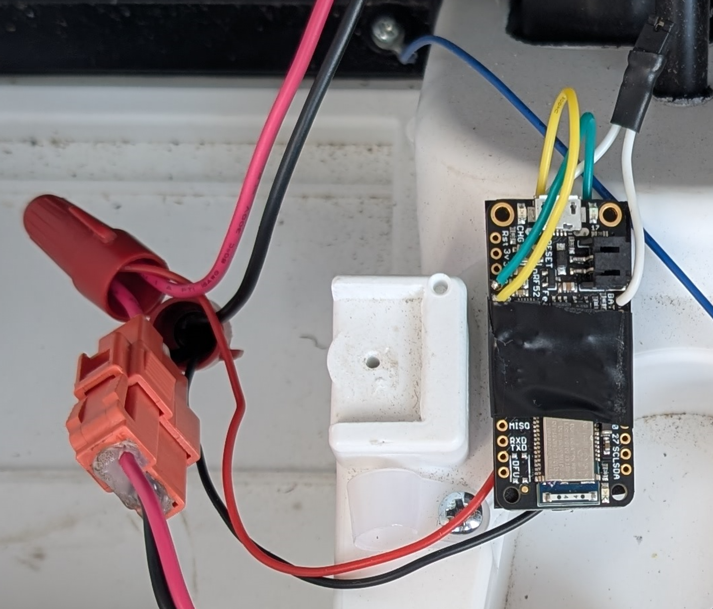
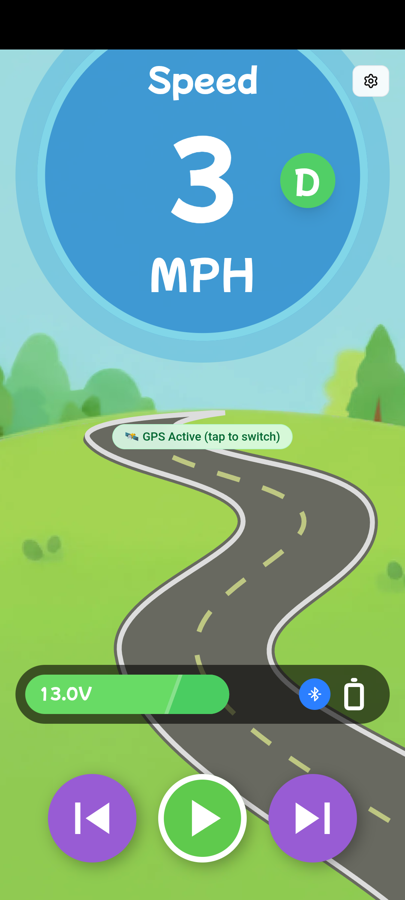
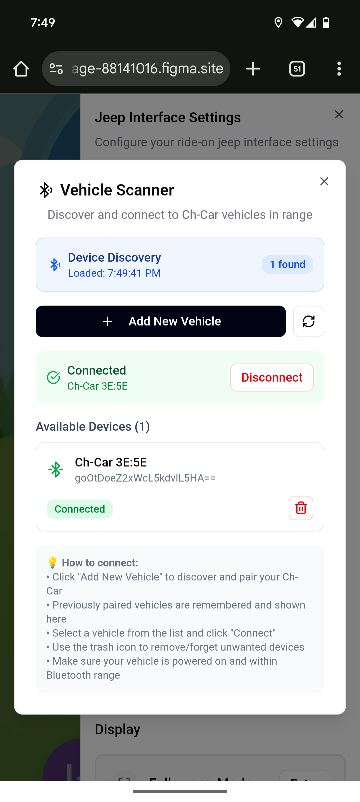

# childrens-motorized-car-app
An app that augments a child's motorized car ride

Built for the [Contra + Figma Make-a-thon](https://contra.com/community/topic/figmamakeathon)

## Hardware
For this is used 2 off the shelf boards:
- Adafruit nrf53832 Feather (from [Adafruit](https://www.adafruit.com/product/3406?srsltid=AfmBOooamjq04jDyUF4mwbBeguHoo3EwBAWuu0ORxaPomnoWzzdPV7Hg))
-  MP1584EN DC-DC Buck Converter (from [Amazon](https://www.amazon.com/MP1584EN-DC-DC-Converter-Adjustable-Module/dp/B01MQGMOKI?th=1))
- Resistors (220k and 46k) for a voltage divider

## Companion App
Here is the app that I made in Figma Make: https://ivory-manage-88141016.figma.site

## BLE Information

- Device Name: `Ch-Car XX:XX`
- Service UUID: `A1B21000-6A47-4D2B-9F2C-5A6E7B8C9D0F`
- Characteristic UUID: `A1B21001-6A47-4D2B-9F2C-5A6E7B8C9D0F`
- Data: 16-bit unsigned little-endian battery voltage
- Unit: millivolts (mV)
- Use: Read once, then subscribe (notifications)
- Convert to volts: mV / 1000